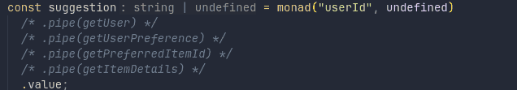

# Chaining callbacks in TypeScript using the monad design pattern

A piece of information often results from linked operations where any of them can potentially return a nullish, invalid value that makes further operations meaningless or might even cause them to throw. This requires thorough checking of returns and parameters at each step in order to achieve consistent results.

Instead of having to do this verification manually - not only very tedious, but also very error-prone - the _monad design pattern_ allows chaining of an arbitrary number of operations in a pipe-like fashion, while preserving type information and encapsulating the handling of nullish values within its implementation.[^1]

[^1]:
    This article will not go into great detail about the theory behind monads and its various implementations. Instead, it will only focus on the explanations and the implementation of a type-safe pipe-like operation in TypeScript which also just happens to be particular _application_ of a monad pattern, because it _seems_ to satisfy its conditions.

    The conditions satisfied here are: 1. the `monadic type` ("nullish types" list) with which the original value types are augmented in a type union via type assertions, function parameters and return typings; the 2. the `unit` operator, where the input and output values are always implicitly augmented as being potentially nullish, and 3. the `bind` operator, as these augmented values are always unwrapped before being passed as a parameter to a function that expects the original value type and which in turn also returns a potentially nullish result. For more information about monads, see the [Wikipedia entry](<https://en.wikipedia.org/wiki/Monad_(functional_programming)>) or these instructive videos: [What is a monad? (Design Pattern)](https://www.youtube.com/watch?v=VgA4wCaxp-Q), [What is a Monad? - The Last Monad Intro You'll Ever Need](https://www.youtube.com/watch?v=HIBTu-y-Jwk). 

    Note the use of the "_seems to satisfy_" phrase in the first paragraph. As no particular expertise in the theoretical foundations of monads is claimed here, there is a possibility that the structures derived here may not satisfy the definition of a monad in the strict sense. The hope is, instead, that they are "close enough" to being a monad - in other words, that they follow the monad design pattern. 

## TLDR

To chain operations with built-in nullish checks:

- Replicate the code (and the imported functions and types) from either the `monad` or `monadAsync` file.
  - Using the `async` monad version is preferred, since it can handle both sync and async callbacks.
- Use `monadSetup | monadAsyncSetup` functions, pass the nullish type list that will form the basis for nullish checks and assign this to a variable.
- Use this variable for chaining operations.

**Example**

```ts
// Suppose undefined and null should be treated as "nullish types"
// that should prevent any further evaluation.
const monadFactory = monadAsyncSetup(null, undefined);

// Chain operations as necessary. Note that all of the arguments are supplied in the
// first invocation, but that the first argument is omitted in subsequent pipe calls
// since the previous pipe operation supplies it.
const result = await monadFactory(cb, firstArgument, ...rest).pipe(cb2 ...rest).value

```

## Setting the stage

Before deriving an example of a monad pattern in TypeScript, let's first illustrate how we would deal with a sequence of potentially nullish values manually. Suppose we want to suggest which item a user should choose based on their hobby. The following functions are available:

```ts
const getUser: (userId: string) => User | undefined;
const getUserPreference: (user: User) => string | undefined;
const getPreferredItemId = (preference: string) => bigint | undefined;
const getItemDetails = (itemId: bigint) => Item | undefined;
```

If the user's id is available, the following steps are required:

    1. Get the user data
    2. Extract the preference
    3. Retrieve the item id based on the preference
    4. Return the item information based on the supplied id.

Each of these operations relies on the "truthy" output of the previous one, but each of them can also potentially return `undefined`.[^2]

[^2]: Although here the `undefined` return is typed explicitly, often these nullish returns remain implicit in non-strict contexts, making it much easier to forget to double check that the result actually resolves to something rather than nothing.

## Manual checking

The most direct approach to deal with optional returns would rely on early returns for each intermediate step.

```ts
const suggestItem = (userId: string): Item | undefined => {
  const user = getUser(userId);
  // Here, the falsy value could also be returned directly
  // in each of the checks, for example: if (!user) return user;
  if (!user) return undefined;
  const preference = getUserPreference(user);
  if (!preference) return undefined;
  const itemId = getPreferredItemId(preference);
  if (!itemId) return undefined;
  return getItemDetails(itemId);
};
```

While this function has a mere 7 lines, 3 of them consist of checking for undefined values. If curly braces for the `if` statements were used, then checks would consume 9 lines out of 12!

This repetition exhibits a clear pattern that should be automated and abstracted away: we want to be able to perform a `piping` operation that has a built-in _short-circuit_ logic in which valid return values can trigger further evaluation, while nullish ones simply echo down the line as far as necessary, with strict typing of results and arguments at each stage. **This is just what monads can do.**

The **monad design pattern**, as it will be implemented here, consists of a function[^3] that takes an initial value and a list of "nullish types" (think values such as `undefined`, `null`, perhaps `0` or `-1`). It returns a **potentially nullish value** property and a **pipe operator**. The pipe operator will take the previous result and conditionally invoke the supplied callback (along with any additional arguments that the callback might require) before returning the same thing as the monad did: a value property containing the _potentially nullish result_ and ... _itself_, _a new pipe operator_ which allows further chaining operations to take place.

[^3]: Although functions will be used here, the same functionality could be achieved with classes as well.




## Monad internals

For the sake of brevity, not all of the helper functions or types are defined here, but their meaning and functionality are often self-evident from their namings. On the other hand, more verbose types are sometimes used (for example for some function signatures) to better illustrate the type relationships. The reader is of course welcome to check out the entire code and typings contained within the [repository's `src` folder](https://github.com/jericirenej/typescript-monads-chaining/tree/main/src).

### Sync monads

At the heart of the monad is the conditional invocation - the `bind` function. It receives the callback, a potentially nullish value (corresponding to the the first argument of the callback), a list of arguments that count as being nullish, and any other additional callback arguments. The bind function encapsulates the nullish check that would otherwise have to be performed manually and conditionally runs the callback.

```ts
const bind = <Args extends unknown[], FirstArgument, Result, Nullish>(
  // Callback takes in a list of arguments and returns a potentially nullish result.
  callback: (...args: Args) => Result | Nullish,
  // Specifies a list of values under which an argument is deemed to be nullish or invalid.
  nullishTypes: Nullish[],
  // The potentially nullish first argument that is either 
  // the initial value or the result of a previous callback call.
  firstArgument: FirstArgument | Nullish,
  // DropFirst is a generic type that returns all of the array elements, except the first.
  ...rest: DropFirst<Args>
):Result | Nullish => {
  // isNullish is a type guard that evaluates whether the firstArgument 
  // can be found within the nullishTypes.
  if (isNullish(firstArgument, nullishTypes)) {
    // Value is nullish. Echo it down the pipeline, do not invoke callback.
    return firstArgument;
  }
  // Value is valid. Combine it with the rest parameters and return the callback result.
  return callback(...([firstArgument, ...rest] as Parameters<typeof callback>));
};
```

When using monads, `bind` never has to be explicitly invoked. Instead, the `pipe` function which facilitates the actual chaining operations will be the one calling it.

`Pipe` is a higher order function which takes in a potentially nullish value (first callback argument) and a list of "nullish value types". It returns another function to which the desired callback and any additional (rest) arguments can be passed as arguments:

```ts
const pipe =
  // The outer function is called either by the monad initializer function or
  // by the pipe itself in its return. It should never have to be invoked manually.
    <FirstArgument, Nullish>(
      prev: FirstArgument | Nullish,
      nullishTypes: Nullish[],
    ) =>
    // The argument list is bound to the FirstArgument type to ensure
    // that the compiler complains if an invalid argument is passed during
    // chaining. This safeguards against potential mismatching of functions.
    <Args extends [FirstArgument, ...unknown[]], Result>(
      callback: (...args: Args) => Result | Nullish,
      ...rest: DropFirst<Args>
    ) => {
      // To arrive at the inner function return, the bind function
      // which takes care of the nullish check is first called...
      const value = bind(callback, nullishTypes, prev, ...rest);
      return {
        // ...the potentially nullish result is returned,
        value,
        // along with a new pipe that allows additional chaining.
        // Note that the pipe itself provides the context to its outer invocation.
        pipe: pipe(value, nullishTypes),
      };
    };
```

The setup is almost complete, all that is left is to start it with an _initializer_ function.

Granted, this extra step is optional, since the pipe itself has everything needed and could simply be called with the initial argument and a list of nullish values, then invoked again with the actual callback and optional rest parameters.

```ts
const result = pipe("userId", [undefined])(getUser)
```

However, that double invocation seems clumsy. The outer call can be refactored to a separate function which gives access to the pipe and value operators.

```ts
const monad = <FirstArgument, Nullish>(
  firstArgument: FirstArgument | Nullish,
  ...nullishTypes: Nullish[]
) => ({ value: firstArgument, pipe: pipe(firstArgument, nullishTypes) });
```

It is now possible to execute an arbitrary chain of type-safe piping operations that take care of the nullish checks automatically and allow adding of any additional arguments that each passed callback might require or allow. Furthermore, it is possible to access the current result or state of the pipe operation at any step of the chaining process.

### Async monads

The monad just defined works perfectly fine as long as all of the piped operations are synchronous. However, often calls to (a mix of sync and) async functions are required. This presents additional considerations:

- Even though pipes will accept async functions, they should not do any awaiting of the results themselves. If they did, each one of them would need to be awaited in turn (e. g. `(await pipe(asyncCb).(await pip(asyncCb2))...`) which would substantially hinder the pipe's usability. Instead, chaining should work just the same as in the sync monad. Only the values themselves should need to be unwrapped with a single `await` call.
- Callback functions expect a resolved value, not Promises that async functions produce. As these results cannot be awaited in the pipe, they need to be resolved in an augmented bind function.

To achieve this, first the `bind` function is modified slightly. It should be async in order to await the potential Promise-like arguments before conditionally invoking the callback:

```ts
const bindAsync = async <Args extends unknown[], FirstArgument, Result, Nullish>(
  // The CallbackSyncOrAsync is just a shorthand for a function that can
  // be sync or async and that returns or resolves to a Result | Nullish type.
  callback: CallbackSyncOrAsync<Args, Result, Nullish>,
  nullishTypes: Nullish[],
  // The first argument can be an ordinary or Promise-like value from a previous
  // pipe operation.
  firstArgument: SyncOrPromise<FirstArgument | Nullish>,
  ...rest: DropFirst<Args>
): Promise<Result | Nullish> => {
  let unwrappedFirst = firstArgument;
  // If passed value is an instance of a Promise it is awaited before
  // performing the nullish check and conditionally invoking the callback.
  // Only the argument needs to be awaited, not the callback invocation itself.
  if (unwrappedFirst instanceof Promise) {
    unwrappedFirst = await unwrappedFirst;
  }
  /*...
    Same code as in the sync function, except the unwrapped variable is used
    instead of the firstArgument.
    ...*/
};
```

The modifications to the `pipeAsync` function are equally subtle, concerning mostly the changed parameter types, the call to the `bindAsync` function, and the result promisification.

```ts
export const pipeAsync = <FirstArgument, Nullish>(
  prev: SyncOrPromise<FirstArgument | Nullish>,
  nullishTypes: Nullish[],
) => {
  // Notice that the type of the FirstArgument needs to be "unwrapped"
  // as the argument might be async.
  return <Args extends [Awaited<FirstArgument>, ...unknown[]], Result>(
    callback: CallbackSyncOrAsync<Args, Result, Nullish>,
    ...rest: DropFirst<Args>
  ) => {
    const value = bindAsync(callback, nullishTypes, prev, ...rest);
    return {
      // Promise.resolve() flattens the nested promise
      // signature that results when an async callback
      // is passed to the bindAsync helper.
      value: Promise.resolve(value),
      pipe: pipeAsync(value, nullishTypes),
    };
  };
};
```

Finally, the initializer function will promisify the initial value and call the `pipeAsync`.

```ts
const monadAsync = <FirstArgument, Nullish>(
  firstArgument: FirstArgument | Nullish,
  ...nullishTypes: Nullish[]
) => ({
  // Since the first argument is most likely not a promise
  // but the value should return one, we promisify it.
  value: Promise.resolve(firstArgument),
  pipe: pipeAsync(firstArgument, nullishTypes),
});
```

### The cherry on the cake: reducing boilerplate

The current monad implementation tries to be as clear and flexible as possible, but this might come at a cost to usability.

- The monad initiator doesn't do anything except prepare the context for the pipe operator which still needs to be invoked manually.
- Oftentimes nullish values are predictable. They will be `undefined` or `undefined | null`. As it stands currently, these values have to be specified each time a monad is created, which can lead to a lot of repetition. And repetition is something we've been trying to avoid.

Both of these issues can be addressed in several ways without touching the original implementations with the help of higher order functions. Let's look at some of them by using the example of the sync monad (the async implementations are available in the `src` folder).

#### Executing the callback with a default nullish type

If `undefined` is the default nullish value and the callback should be executed while defining a monad, this can be achieved in the following way:

```ts
type DefaultNullType = undefined;
type DefaultMaybe<T> = T | DefaultNullType;

export const monadRun = <
  FirstArgument,
  Args extends [FirstArgument, ...unknown[]],
  Result,
>(
  callback:  (...args: Args) => DefaultMaybe<Result>,
  firstArgument: DefaultMaybe<FirstArgument>,
  ...rest: DropFirst<Args>
) => {
  const nullishTypes: DefaultNullType[] = [undefined];
  return monad(firstArgument, ...nullishTypes).pipe(callback, ...rest);
};

// Use case:
const result = monadExec(callback, ...argumentList)
  .pipe(secondCallback, ...argumentList)
  .pipe(thirdCallback, ...argumentList).value;
```

#### Defining nullish conditions, but deferring execution until needed

On the other hand, it might be more desirable to just setup the "nullish types" context, but then invoke the monad again with some arbitrary callback and arguments at various points in our code.

```ts
export const monadSetup =
  // First invocation will only take in the nullish list and do nothing
  // until invoked for the second time.
    <Nullish>(...nullishTypes: Nullish[]) =>
    // Here the procedure is similar as in the monadRun implementation
    <FirstArgument, Args extends [FirstArgument, ...unknown[]], Result>(
      callback: (...args: Args) => DefaultMaybe<Result>,
      firstArgument: FirstArgument | Nullish,
      ...rest: DropFirst<Args>
    ) =>
      monad(firstArgument, ...nullishTypes).pipe(callback, ...rest);

// Use case:
const monad = monadSetup(undefined, null, -1);

const result = monad(callback, firstArgument, ...rest).pipe(
  secondCallback,
  ...rest,
).value;
```

## Conclusion

Repetition of the same logical checks and conditional invocations while performing successive operations is something that is required, but at the same time this requirement should not be done manually in order to prevent errors, improve readability and reduce code bloat.

The monad design pattern offers a solution by abstracting the logical principles behind this repetition and encapsulating them within its implementation, while offering a straightforward configuration setup and an intuitive interface for chaining operations and extracting their results. Hopefully, the structures derived in this article and the associated [repository](https://github.com/jericirenej/typescript-monads-chaining) are a useful example of that.
